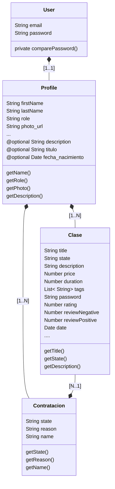
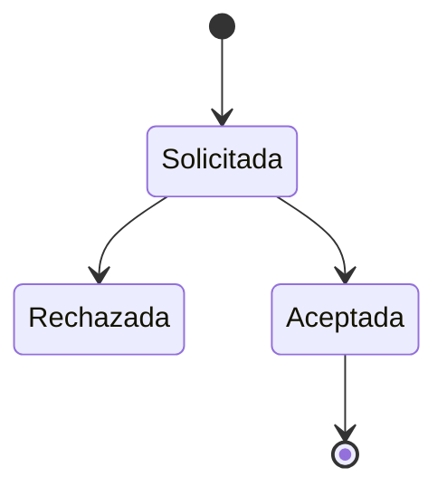
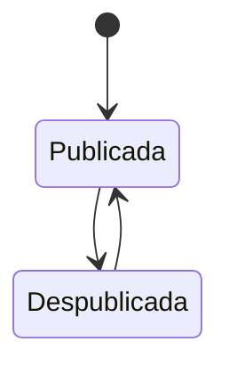

# Classhire back-end
Seeded by https://github.com/SEI-Remote/decoupled-mern-jwt-auth-template-back-end

# .env.default
```
# DATOS MONGO
DATABASE_URL=mongodb://localhost:27017/classhire
MONGO_USER=service
MONGO_PASSWORD=secret
SECRET=secret

# DATOS CLOUDINARY API
CLOUDINARY_USER=xxxxxxx
CLOUDINARY_API_KEY=xxxxx-xxxxx-xxx
CLOUDINARY_SECRET=xxxxxxxxx

# DATOS GMAIL API
GMAIL_API_KEY=xxxx-xxxxxx
GMAIL_API_SECRET=xxxxx
GMAIL_API_REDIRECT_URI=https://localhost:3000/
GMAIL_API_REFRESH_TOKEN=xxxxxxxxxx
```

# Dependencias

| Dependencia      | Usage      | Ref. |
| ----------- | ----------- | ----------- |
| express   | Dependencia para levantar servicio en NodeJS | https://www.npmjs.com/package/express |
| express-basic-auth   | Gestion de HTTP Basic Authorization | https://www.npmjs.com/package/express-basic-auth |
| express-form-data   | Gestion de form-data para ciertos endpoints PATCH | https://www.npmjs.com/package/express-form-data |
| express-validator  | Para validar campos obligatorios de ciertas requests | https://www.npmjs.com/package/express-validator |
| bcrypt   | Utilizado para encriptar informacion sensible como passwords | https://www.npmjs.com/package/bcrypt |
| cloudinary   | Para subir imagenes a la plataforma de cloudinary, utilizado para fotos de perfil | https://www.npmjs.com/package/cloudinary |
| cors   | Politicas de CORS | https://www.npmjs.com/package/cors |
| debug   | Debugging mediante attach a procesos | https://www.npmjs.com/package/debug |
| dotenv   | Dependencia para gestionar secretos en variables de entorno del SO. | https://www.npmjs.com/package/dotenv |
| googleapis   | Para envio de mails a traves de Google APIs. | https://www.npmjs.com/package/googleapis |
| nodemailer   | Envio de mails | https://www.npmjs.com/package/morgan |
| jsonwebtoken   | Creacion, firmado nodemaileracion de JWT para authorizacion | https://www.npmjs.com/package/jsonwebtoken |
| moment   | Libreria recomendada para la gestion del tiempo en JS | https://www.npmjs.com/package/moment |
| mongoose   | Driver para manejar la base de datos documental | https://www.npmjs.com/package/mongoose |
| mongoose-paginate   | Driver para manejar la base de datos documental - funcion de paginado | https://www.npmjs.com/package/mongoose-paginate |
| mongoose-aggregate-paginate-v2   | Driver para manejar la base de datos documental - funcion de paginado y aggregate para consultas complejas | https://www.npmjs.com/package/mongoose-aggregate-paginate-v2 |
| morgan   | Loggings | https://www.npmjs.com/package/morgan |
| swagger-autogen   | Generacion de documentacion | https://www.npmjs.com/package/swagger-autogen |
| swagger-ui-express   | Generacionswagger-ui-expresscion | https://www.npmjs.com/package/swagger-ui-express |

# Como conectarse a GMAIL API
https://fusebit.io/blog/gmail-api-node-tutorial/?utm_source=www.google.com&utm_medium=referral&utm_campaign=none

# Clases y Relaciones


# Estado de Contrataciones



# Estado de Clases
